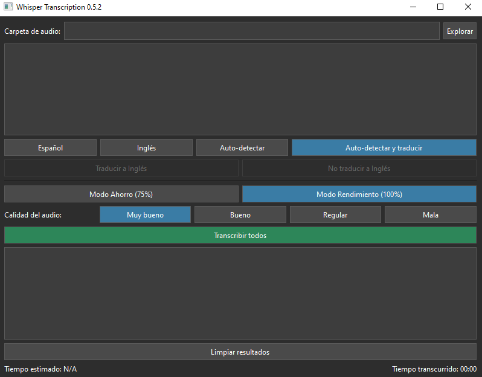

# Whisper Transcription GUI

Whisper Trasncription GUI es una aplicación fácil de usar que aprovecha el modelo Whisper de OpenAI para transcribir archivos de audio de manera local. Desarrollada con Python y PyQt6, esta herramienta ofrece una interfaz intuitiva para procesar archivos de audio por lotes, con soporte para múltiples idiomas y opciones de traducción.



## Características

- 🎧 Soporta múltiples formatos de audio (.mp3, .wav, .m4a, .flac, .ogg)
- 🌐 Detección automática de idioma y traducción al inglés
- 🔢 Procesamiento por lotes de archivos de audio
- 🎚️ Configuración ajustable de temperatura para precisión en la transcripción
- 💻 Opciones de optimización de uso de CPU
- 📊 Seguimiento del progreso y estimación de tiempo
- 📁 Estructura de salida organizada reflejando las carpetas de entrada

## Requisitos

- Python 3.8+
- PyQt6
- transformers
- torch
- mutagen
- psutil

## Instalación

1. Cloná el repositorio
   ```
   $ git clone https://github.com/stdelprato/whisper-transcription.git
   $ cd whisper-transcription-gui
   ```

2. Creá y activá un entorno virtual (opcional pero recomendado)
   ```
   $ python -m venv venv
   $ source venv/bin/activate  # En Windows, usá ``` venv\Scripts\activate ```
   ```

3. Instalá los paquetes requeridos
   ```
   $ pip install -r requirements.txt
   ```

## Uso

1. Ejecutá la aplicación
   ```
   $ python main.py
   ```

2. La interfaz gráfica se abrirá ahora. Seguí estos pasos:
   - Hacé clic en "Explorar" para seleccionar una carpeta con archivos de audio
   - Elegí la configuración de idioma
   - Ajustá la temperatura si es necesario
   - Hacé clic en "Transcribir todos" o seleccioná archivos específicos
   - Esperá a que se complete la transcripción
   - Encontrá la salida en la carpeta "results"

## Contribuciones

¡Las contribuciones son bienvenidas! No dudes en enviar un Pull Request.

## Licencia

Este proyecto está licenciado bajo la Licencia MIT - mirá el archivo LICENSE para más detalles.

Hecho con ❤️ usando el modelo Whisper de OpenAI y PyQt6